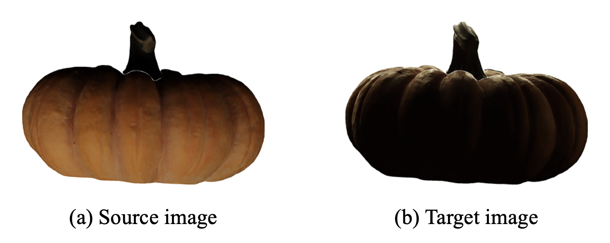

<div align=center>
  <h1>
  LIT :fire: : Lighting-Conditioned Image Translation
  </h1>
  <p>
    <a href=https://mhsung.github.io/kaist-cs492d-fall-2024/ target="_blank"><b>KAIST CS492(D): Diffusion Models and Their Applications (Fall 2024)</b></a><br>
    Course Project
  </p>
</div>

<div align=center>
  <p>
    Instructor: <a href=https://mhsung.github.io target="_blank"><b>Minhyuk Sung</b></a> (mhsung [at] kaist.ac.kr)<br>
    TA: <a href=https://jh27kim.github.io/ target="_blank"><b>Jaihoon Kim</b></a>  (jh27kim [at] kaist.ac.kr)
  </p>
</div>

<div align=center>
   
   <figcaption>
    Large scale image dataset of real-world objects with diverse materials and geometries, captured under various illuminations.
    <i>Source: <a href="https://oppo-us-research.github.io/OpenIllumination/">OpenIllumination dataset.</a></i>
    </figcaption>
</div>

## Description
In this project, your task is to implement a conditional image diffusion model that takes a source image with its lighting conditions and generates an image with the target lighting conditions. 
You will use real-world object images captured under different lighting conditions provided by [OpenIllumination](https://huggingface.co/datasets/OpenIllumination/OpenIllumination). 

## Data Specification
> :warning: Do **NOT** use the pairs of images specified in `eval.json`, as these will be used for evaluation. Failure to meet this criterion may result in a zero score.

OpenIllumination dataset provides two kinds of lighting conditions: OLAT (One-Light-At-a-Time) and lighting patterns. In this task, we will focus on lighting patterns conditions (13 patterns). 
Use the following command to download `lighting_patterns` dataset:
```
python open_illumination.py --light lighting_patterns --local_dir {$LOCAL_DIR}
```
The dataset consists of 64 objects, each captured under 13 different lighting patterns and 48 distinct camera poses. 
The dataset structure is outlined below:
```
./obj_01_car/
├── Lights                         # Light patterns (13)
│   ├── 001
│   │   └── raw_undistorted        # Images captured using "001" light pattern (48 per pattern)
│   │       ├── CA2.JPG
│   │       ├── CA4.JPG
│   │       ├── ...
│   │       └── NF7.JPG
│   ├── 002
└── output
    ├── com_masks                  # Object + support mask 
    ├── obj_masks                  # Foreground object masks (May not be visible as stored in [0-1])
    │   ├── CA2.png
    │   ├── CA4.png
    │   ├── ...
    │   └── NF7.png
    ├── ...
```

Note that the images are not square, and the objects are not center-aligned. 
For those who wish to preprocess the images to be square and center-aligned, refer to `preprocess_img.py` (originally provided for evaluation purposes).

## Tasks
Your task is to implement a conditional diffusion model that takes a source image and its lighting condition and generates a target image with the desired lighting condition.
An example of the input and the desired output images is shown in the figure below.

<div align="center">
  <figure>
    
    <br />
    <figcaption style="text-align: center;">
      Example of a source image (a) under one lighting condition and a target image (b) under a different lighting condition.
    </figcaption>
  </figure>
</div>

## Evaluation
Once the training is completed, generate images with the target lighting condition (specified in the `tgt_light` field) using the source images (from the `src_img_path` field) in `eval.json`. The source and target images capture the same object with the same camera pose but under different lighting conditions. 
Note that the generated images should have the **SAME** filename as the dictionary keys (e.g., `obj_14_red_bucket_src_003_tgt_010_NA1`) to correctly identify the target images during evaluation. 

For evaluation, we will use the center-aligned ground truth images.
Run the following command to preprocess the ground truth images:
```
python preprocess_img.py --dataroot {$dataroot} --save_root {$save_root}
```
Note that if you used raw images (non-square, not center-aligned) during training, the source images should also be preprocessed to ensure accurate results.
After the preprocessing step, place the generated and ground truth images in the same directory, respectively, and ensure that each pair of images shares the same filename, as shown below:
```
├── source                                          # Generated images from your model
│   ├── obj_01_car_src_009_tgt_004_CE2.png
│   ├── obj_02_egg_src_003_tgt_010_CC5.png
│   ├── ...
│   └── obj_64_greenhead_src_011_tgt_010_CD8.png
└── target                                          # Ground truth images of eval.json
    ├── obj_01_car_src_009_tgt_004_CE2.png
    ├── obj_02_egg_src_003_tgt_010_CC5.png
    ├── ...
    └── obj_64_greenhead_src_011_tgt_010_CD8.png
```

We will use FID, PSNR, SSIM, and LPIPS scores to assess the diversity and fidelity of the generated images compared to the ground truth target images.
First, install the following packages 
```
pip install lpips clean-fid torchmetrics
```

Then run the following command to evaluate on these metrics: 
```
python eval.py --fdir1 {$FDIR1} --fdir2 {$FDIR2} --save_dir {$SAVE_DIR}
```
`fdir1` and `fdir2` refer to the paths of the ground truth and generated images, respectively, and `save_dir` is the path where the evaluation output file will be saved.


Use the pairs of images specified in `eval.json` to evaluate the model.
Note that neither the source nor the target images may be used during training.


## Acknowledgement 
We appreciate the authors of [OpenIllumination](https://oppo-us-research.github.io/OpenIllumination/) for releasing their dataset to public. 
