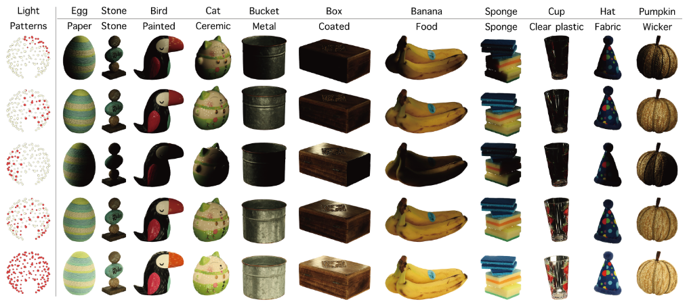

<div align=center>
  <h1>
  LIT :fire: : Lighting-Conditioned Image Translation
  </h1>
  <p>
    <a href=https://mhsung.github.io/kaist-cs492d-fall-2024/ target="_blank"><b>KAIST CS492(D): Diffusion Models and Their Applications (Fall 2024)</b></a><br>
    Course Project
  </p>
</div>

<div align=center>
  <p>
    Instructor: <a href=https://mhsung.github.io target="_blank"><b>Minhyuk Sung</b></a> (mhsung [at] kaist.ac.kr)<br>
    TA: <a href=https://jh27kim.github.io/ target="_blank"><b>Jaihoon Kim</b></a>  (jh27kim [at] kaist.ac.kr)
  </p>
</div>

<div align=center>
   
   <figcaption>
    A real-world images of objects with diverse materials and geometries, captured under various illuminations.
    <i>Source: <a href="https://oppo-us-research.github.io/OpenIllumination/">OpenIllumination dataset.</a></i>
    </figcaption>
</div>

## Description
In this project, your task is to implement a conditional image diffusion model that takes a source image with its lighting conditions and generates an image with the target lighting conditions. 
You will use real-world object images captured under different lighting conditions provided by [OpenIllumination](https://huggingface.co/datasets/OpenIllumination/OpenIllumination). 

## Data Specification
There are two kinds of lighting conditions: OLAT (One-Light-At-a-Time) and lighting patterns. In this task, we will focus on OLAT conditions (142 cases). 
Use the following command to download OLAT dataset:
```
python open_illumination.py --light OLAT --local_dir {$LOCAL_DIR}
```
The dataset provides the following fields:
- file_path: file path to an image
- light_idx: index of illuminations (0 to 141 for OLAT)
- transform_matrix: OpenCV convention camera pose
- camera_angle_x: camera angle to compute camera intrinsic

## Tasks
Your task is to implement a conditional diffusion model that takes a source image and its lighting condition and generates a target image with the desired lighting condition.
Report evaluation metrics using the test dataset. 

## Evaluation
We will evaluate your model on unseen test dataset. Use training and validation dataset to train your model. 

## Acknowledgement 
We appreciate the authors of [OpenIllumination](https://oppo-us-research.github.io/OpenIllumination/) for releasing their dataset to public. 
